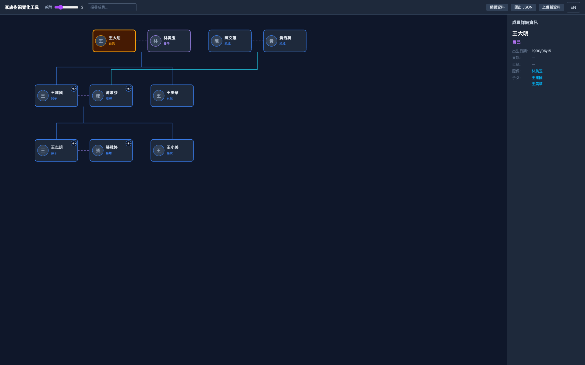
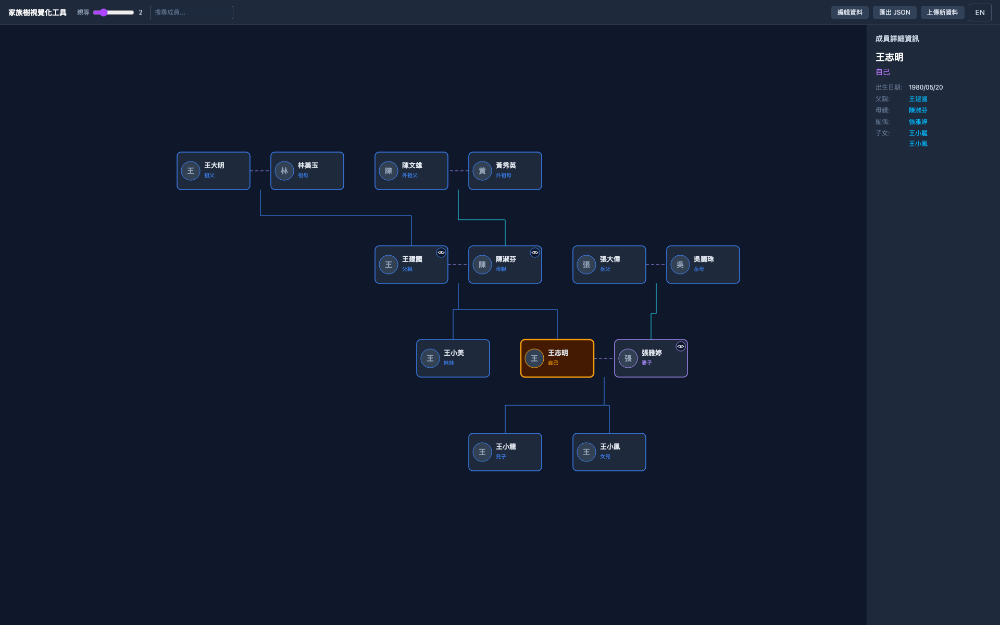

# family-tree

Interactive family-tree visualizer. Focus on any person and the view re-centers around them, showing kin out to a configurable degree with proper Chinese/English kinship labels (堂兄 vs. 表兄, 伯父 vs. 叔叔, 妯娌, 連襟, and so on).

**Live demo:** https://janbarry5168.github.io/family-tree/

| Focused on the patriarch | Focused on his grandson |
|---|---|
|  |  |

## Features

- Focused-person-centric layout — click any node to re-center the tree around them
- Bilingual kinship labels (English + Traditional Chinese) resolved from structural relationships, gender inference, and birth order
- Degree filter to expand or collapse the visible tree
- Per-person hide-branch toggle that collapses everyone reachable only through that person (in-laws, distant relatives) so you can focus on the part of the tree you care about
- Load your own data via JSON upload, or try the bundled demo
- Auto-save to `localStorage` every 30 seconds; landing page offers to restore on return
- Pan / zoom / fit-to-view (powered by d3-zoom)
- In-app editor panel to add, edit, and delete persons
- No backend — everything runs in the browser

## Try it with your data

Open the [live demo](https://janbarry5168.github.io/family-tree/), click **Try the demo** for the bundled sample, or upload your own JSON. See [`public/demo-data.json`](public/demo-data.json) for a complete example.

```json
[
  { "id": "1", "name": "王大明", "gender": "male",   "father": "",  "mother": "",  "spouse": "2", "birthOrder": 1, "birthDate": "19300615", "photo": "", "root": true },
  { "id": "2", "name": "林美玉", "gender": "female", "father": "",  "mother": "",  "spouse": "1", "birthOrder": 1, "birthDate": "1932",     "photo": "" },
  { "id": "3", "name": "王建國", "gender": "male",   "father": "1", "mother": "2", "spouse": "",  "birthOrder": 1, "birthDate": "19550811", "photo": "" }
]
```

| Field        | Type                    | Notes                                                                                                |
|--------------|-------------------------|------------------------------------------------------------------------------------------------------|
| `id`         | string, required        | Unique within the file                                                                               |
| `name`       | string, required        | Display name                                                                                         |
| `gender`     | `"male" \| "female"`    | Optional — inferred from structure/spouse when absent                                                |
| `father`     | id string               | Empty string `""` if unknown                                                                         |
| `mother`     | id string               | Empty string `""` if unknown                                                                         |
| `spouse`     | id string               | Should be reciprocal; one-way links produce a warning                                                |
| `birthOrder` | number, required        | Used to order siblings and resolve elder/younger terms                                               |
| `birthDate`  | string                  | `""` (unknown), `"YYYY"` (year only), or `"YYYYMMDD"`. Legacy `birthYear` (number) is auto-migrated. |
| `photo`      | string (URL / data URI) | Empty string renders the person's initial                                                            |
| `root`       | boolean                 | Optional. First row with `root: true` becomes the initial focused person after loading.               |

Validation rules: duplicate ids, missing required fields, and circular parent chains are blocking errors. Broken references, non-mutual spouse links, and duplicate birth orders within a sibling group are shown as warnings.

## Architecture & engineering

Three-layer separation: pure-TS engine, reducer+context state, React+SVG UI. The engine layer is framework-free, which is what makes the kinship logic unit-testable in isolation.

### Tech stack

- **Build / runtime**: Vite 8 + React 19 + TypeScript (strict — `noUnusedLocals`, `verbatimModuleSyntax`, `erasableSyntaxOnly`); SPA, no backend
- **Rendering**: hand-rolled SVG canvas; **D3 is used only for `d3-zoom`** (pan / zoom / fit-to-view transitions), not for layout
- **Styling**: Tailwind CSS 4
- **State**: single `useReducer` + React Context (`FamilyTreeContext`) — no Redux / Zustand
- **Persistence**: `localStorage` auto-save every 30s (key `family-tree-data`); data source is an uploaded JSON file or the bundled `public/demo-data.json`
- **i18n**: `react-i18next` with `en` + `zh-TW`; language persisted under `family-tree-lang`
- **Testing**: Vitest + jsdom + `@testing-library/jest-dom`
- **Deploy**: GitHub Pages, base path `/family-tree/`

### Algorithms

All algorithms live in pure TS under `src/engine/` and are unit-tested in isolation.

| Module                     | Algorithm                                                                                                     | Purpose                                                                                                                                     |
|----------------------------|---------------------------------------------------------------------------------------------------------------|---------------------------------------------------------------------------------------------------------------------------------------------|
| `kinship.ts`               | **Dijkstra** with weighted edges — spouse = 0, parent/child = 1, sibling-when-parent-missing = 2              | 親等 (civil-law degree) counting per Taiwan 民法 §§ 968, 970; drives the degree filter                                                      |
| `layout.ts`                | **BFS** from focused person to assign generation; row-ordering by sibling group + `birthOrder`, spouses pinned adjacent | Custom tree layout with the focused person fixed at `x = 0`                                                                                 |
| `hiddenReachability.ts`    | **Walled BFS** — hidden anchors are visited but their neighbors are not traversed                             | Resolves which ids the per-node hide-branch button collapses                                                                                |
| `hiddenReachability.ts`    | **Iterative Tarjan articulation points** (DFS with `disc` / `low` arrays)                                     | Decides whether a hide button on a given card would actually prune anyone — cards that aren't cut vertices don't show the button            |
| `relationships.ts`         | **BFS shortest path** over edge tokens (`father` / `mother` / `spouse` / `child` / `sibling`) + gender/elder resolver | Bilingual kinship labels; extension point for new terms                                                                                     |
| `ConnectionLines.tsx`      | **Couple-hub pattern** — one trunk from couple midpoint, one shared horizontal branch bar, per-child drops; keyed by sorted `fatherId\|motherId`, Y-staggered, 4-color palette | Disambiguates overlapping sibling groups in the SVG connector layer                                                                         |

### Design patterns

- **Three-layer separation (enforced)**: `src/engine/` must not import from `react`, `d3-*`, or `react-i18next`. This is what makes the engine trivially unit-testable from `tests/engine/`.
- **Reducer + Context** for global state; a single action set (`LOAD_DATA`, `SET_FOCUSED`, `TOGGLE_PERSON_HIDDEN`, …) is the only way to mutate the store.
- **Memoization boundary**: `TreeCanvas.tsx` is the only UI call site for `computeKinshipDegrees` / `computeHiddenIds` / `computeArticulationPoints` / `computeLayout`, all wrapped in `useMemo`.
- **Normalizer at the data edge**: `validation.normalizePerson` coerces raw JSON into the `Person` shape (empty strings, never `null` / `undefined`) and auto-migrates legacy `birthYear` → `birthDate`.
- **Bilingual label pairs**: the engine returns `{ en, zhTW }`; the UI picks via `i18n.language`. Labels are never hard-coded in components.
- **Ephemeral vs. persisted state split**: `focusedPersonId` drives layout and is persisted; `selectedPersonId` is session-only UI state for the info panel.
- **Isolated D3 surface**: the `useD3Zoom` custom hook is the only place `d3-zoom` is touched — the rest of the component tree is D3-free.

## Run it locally

Requirements: Node.js 20+ and npm.

```bash
npm install
npm run dev
```

Vite serves under the `/family-tree/` base path — open the URL it prints.

<details>
<summary>Other scripts</summary>

| Command                 | Purpose                                 |
|-------------------------|-----------------------------------------|
| `npm run dev`           | Vite dev server with HMR                |
| `npm run build`         | Type-check (`tsc -b`) and bundle        |
| `npm run preview`       | Preview the production build locally    |
| `npm run lint`          | ESLint on all `.ts` / `.tsx` files      |
| `npm test`              | Vitest in watch mode                    |
| `npm run test:run`      | Vitest single pass (CI-friendly)        |
| `npm run test:coverage` | Vitest with V8 coverage report          |

</details>

## Deployment, license, further reading

Pushing to `main` deploys to GitHub Pages via `.github/workflows/deploy.yml`. The site is served under `/family-tree/`, which is configured as `base` in `vite.config.ts`; in-code URL construction uses `import.meta.env.BASE_URL` so the app works both in dev and when hosted on Pages.

Released under the MIT License — see [LICENSE](LICENSE).

For architectural deep-dive and contribution conventions, see [CLAUDE.md](CLAUDE.md).
